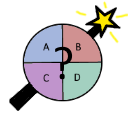
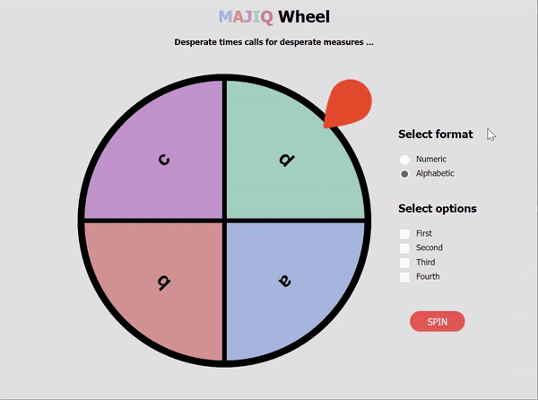

  

<h1 align="center">MAJIQ Wheel</h1>

*MAJIQ Wheel is a web browser extension originally intended for randomly selecting an answer for multiple choice questions.*

Chrome Store: https://chrome.google.com/webstore/detail/majiq-wheel/ppooppbgpecgjkajonpfapehnebehaba

## Usage

  

Users of the MAJIQ Wheel can:

* Select the format of options (either numeric, alphabetic or you choose your options).
* Select which options to choose between (for numeric and alphabetic only).

Here are some possible use-cases of the MAJIQ Wheel: choosing between MCQ answers, randomizing the player order when playing a board game with friends, ...

## Changelog

> Jan 9th, 2022

* Deployment

> Jan 11th, 2022

* Users can now select up to 8 options.
* Users will be able to choose "Other" format allowing them to manually type their inputs.

> Jan 13th, 2022

* Version 2 of MAJIQ is complete.

## Instructions for Developers

> Users must have the latest [Node.js](https://nodejs.org/en/download/) version installed on their computer.

### Google Chrome / Microsoft Edge ### 
1. Clone the repo in your prefered directory.

 &nbsp;&nbsp;&nbsp;&nbsp;&nbsp;&nbsp;`git clone https://github.com/zichzhang/Chrome-Extension-MCQ-Selector.git`

2. Change into the `Chrome-Extension-MCQ-Selector` directory and open the project in your editor of choice.

&nbsp;&nbsp;&nbsp;&nbsp;&nbsp;&nbsp;`cd Chrome-Extension-MCQ-Selector`

3. Install all dependencies.

&nbsp;&nbsp;&nbsp;&nbsp;&nbsp;&nbsp;`npm install`

4. Generate the `build` folder.

&nbsp;&nbsp;&nbsp;&nbsp;&nbsp;&nbsp;`npm run build` or `yarn build` (if you have yarn installed)

5. In Chrome/Edge go to the extensions page (`chrome://extensions` or `edge://extensions`).

6. Enable Developer Mode (located in the top right corner).

7. Load unpacked folder (located in the top left corner).

8. Select the newly generated `build` folder. 
